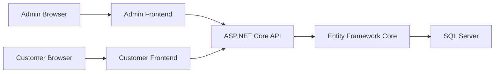

<div align="center">

# Ametia Smart Tourism Guide

**A full-stack tourism discovery and content-management platform for Egypt**

Collaborative graduation project by **Ahmed Abdelmonem** and **Ahmed Helal**


No public live demo is currently deployed.

[Overview](#project-overview) · [Features](#verified-features) · [Architecture](#architecture) · [Local setup](#local-development) · [Security](#security) · [Contributors](#project-ownership)

</div>

## Project overview

Tourism information is often spread across unrelated sources. Ametia brings city-based destinations and practical visitor services into one customer experience backed by a central API and SQL Server database. Customers can discover places and maintain a profile, while administrators manage the same records through a separate browser dashboard.

The system consists of a .NET Web API, a plain HTML/CSS/JavaScript customer frontend, and a plain HTML/CSS/JavaScript admin frontend. Both frontends use the same public API contracts and database. Ametia Smart Tourism Guide was developed collaboratively by Ahmed Abdelmonem and Ahmed Helal as a graduation project.

## Repository navigation

- [ASP.NET Core API](backend/Ametia.Api)
- [Admin dashboard](frontend/admin)
- [Customer frontend](frontend/user)
- [API endpoint reference](docs/api-reference.md)
- [Repository audit and cleanup record](docs/repository-audit.md)

## Verified features

### ASP.NET Core API

- City, hotel, restaurant, tourism-place, entertainment-place, bank, embassy, and place-type CRUD endpoints.
- Customer registration, login, profile retrieval, profile update, logout, and user-management endpoints.
- City-specific destination queries and read-only visitor-service aggregation.
- Entity Framework Core persistence through a generic repository and SQL Server provider.
- Three retained EF Core migrations and a model snapshot.
- Development Swagger/OpenAPI documentation.
- Credentialed CORS allow-list for the documented customer and admin origins.
- In-memory ASP.NET Core session state for signed-in customer profiles.

### Admin dashboard

- Browser-based list, create, update, and delete workflows for cities, hotels, restaurants, tourism places, entertainment places, banks, embassies, and place types.
- User listing, update, and delete screens.
- Multipart image upload and previews where the underlying entity supports images.
- One central `config.js` for API integration.

### Customer frontend

- Registration, login, profile, profile update, and logout workflows.
- City browsing and city-specific destination discovery.
- Listings and filtering for hotels, restaurants, tourism places, entertainment places, banks, and embassies.
- Visitor-services and entity-detail pages, including location maps where coordinates exist.
- Source-integrated Leaflet/OpenStreetMap details maps and a Dialogflow Messenger widget on the home page.
- One central `config.js` for API integration.

## Technology stack

| Layer | Technology | Version verified from source |
|---|---|---|
| Runtime | .NET / ASP.NET Core Web API | `net8.0` / 8.0 shared framework |
| ORM | Microsoft Entity Framework Core | 9.0.0 |
| Database provider | Microsoft.EntityFrameworkCore.SqlServer | 9.0.0 |
| Local database | SQL Server LocalDB | Machine-provided `MSSQLLocalDB`; database `AmetiaLocalDev` |
| API documentation | Swashbuckle.AspNetCore | 6.6.2 |
| EF CLI manifest | `dotnet-ef` | 9.0.6 |
| Frontends | HTML5, CSS3, JavaScript | Browser-native ES6+ |
| UI and icons | Bootstrap; Font Awesome | 5.3.0; 6.4.0 and 6.5.0 |
| Maps | Leaflet; OpenStreetMap tiles | 1.9.4; hosted tile service |
| Chat widget | Dialogflow Messenger | Fast Messenger bootstrap v1 |

The frontends have no package manager, compilation step, or framework build pipeline.

## Architecture



## Database and backend structure

- `Controllers/` defines the existing routes and JSON or multipart request binding.
- `DTOs/` contains composite response types retained from the original design.
- `Models/` contains the database entities and `AppDbContext`.
- `Repositories/` contains the generic repository interface and EF Core implementation.
- `Migrations/` contains the three existing schema migrations and model snapshot.
- `Program.cs` registers controllers, SQL Server, repositories, Swagger, CORS, session, and middleware.

The original namespace and contract spellings—including `Grad`, `Distnation`, `Resturant`, `Embasse`, and `Tourismt_Place`—are intentionally retained so routes, serialization, migrations, and frontend calls remain compatible. The complete route inventory is in [docs/api-reference.md](docs/api-reference.md).

Login creates an in-memory session with a 30-minute idle timeout. The `.Ametia.Session` cookie is HTTP-only, secure, essential, and `SameSite=None`. Session state does not survive an API restart or scale across API instances.

Swagger is available only in the Development environment:

- API base: `https://localhost:7124/api`
- Swagger UI: `https://localhost:7124/swagger`
- OpenAPI JSON: `https://localhost:7124/swagger/v1/swagger.json`

## Local development

### Prerequisites

- .NET 8 SDK or newer with .NET 8 targeting support
- SQL Server LocalDB (`MSSQLLocalDB`)
- Python 3 for the static frontend servers
- A trusted ASP.NET Core development HTTPS certificate

Trust the certificate once if needed:

```powershell
dotnet dev-certs https --trust
```

### Clone

```powershell
git clone https://github.com/Ahmed15109/Ametia-Smart-Tourism-Guide.git
cd Ametia-Smart-Tourism-Guide
```

### First-time database setup

From the repository root:

```powershell
cd backend
dotnet user-secrets set "ConnectionStrings:MyConnection" "Server=(localdb)\MSSQLLocalDB;Database=AmetiaLocalDev;Trusted_Connection=True;TrustServerCertificate=True;MultipleActiveResultSets=true;" --project Ametia.Api/Ametia.Api.csproj
dotnet tool restore
dotnet ef database update --project Ametia.Api/Ametia.Api.csproj --startup-project Ametia.Api/Ametia.Api.csproj
```

`AmetiaLocalDev` is the persistent local development database. The project already has a `UserSecretsId`; the connection string is stored in machine-local .NET User Secrets and is not committed. Never reuse a hosted or production connection string for local setup.

For deployment, provide `ConnectionStrings__MyConnection` and the `Cors__AllowedOrigins__N` values through the hosting environment. Do not add deployment credentials to `appsettings.json`.

### API

From the repository root:

```powershell
cd backend
dotnet run --project Ametia.Api/Ametia.Api.csproj --launch-profile https
```

### Admin dashboard

In a second terminal, from the repository root:

```powershell
cd frontend/admin
python -m http.server 5501 --bind 127.0.0.1
```

### Customer frontend

In a third terminal, from the repository root:

```powershell
cd frontend/user
python -m http.server 5500 --bind 127.0.0.1
```

Open:

- Swagger: `https://localhost:7124/swagger`
- Admin dashboard: `http://127.0.0.1:5501`
- Customer frontend: `http://127.0.0.1:5500`

Each frontend defaults to `https://localhost:7124/api` in its own `config.js`. For future deployment, change that single default or define `window.AMETIA_API_BASE_URL` before `config.js` loads. Keep deployed frontend origins in the API CORS allow-list.

## Verified integration

The completed local end-to-end verification used LocalDB only; no hosted database was contacted.

- API startup and Swagger/OpenAPI returned HTTP 200.
- All three EF Core migrations were applied to a disposable integration database, then confirmed against persistent `AmetiaLocalDev`.
- Both static frontends loaded from ports 5500 and 5501.
- Registration, session login, profile retrieval/update, and logout passed.
- CRUD passed for city, hotel, restaurant, tourism place, entertainment place, bank, embassy, and place type.
- Admin-created city and hotel records appeared in the customer frontend; updates and deletions propagated correctly.
- Disposable integration records and the disposable database were removed. `AmetiaLocalDev` remains available for development.

## Testing status

No automated test project currently exists. The verification above was performed manually and end to end with HTTP, browser, session, CORS, CRUD, and database checks. Automated unit, integration, and browser coverage remains recommended.

## Security

Current protections include HTTPS redirection, machine-local User Secrets, a credentialed CORS allow-list, and an HTTP-only/secure/`SameSite=None` session cookie.

Important limitations remain:

- Passwords use unsalted SHA-256 instead of a modern adaptive password hasher.
- Login credentials are carried in URL route segments and may appear in logs.
- Admin and user-management endpoints do not have authentication or authorization enforcement.
- Some endpoints return complete user entities, including stored password hashes.
- State-changing session requests have no CSRF protection.
- Sessions are in-memory and single-instance.

Treat the current deployment model as a local academic demonstration until these items are addressed.

## Project structure

```text
Ametia-Smart-Tourism-Guide/
├── backend/
│   ├── .config/
│   │   └── dotnet-tools.json
│   ├── Ametia.Api.sln
│   └── Ametia.Api/
│       ├── Controllers/
│       ├── DTOs/
│       ├── Migrations/
│       ├── Models/
│       ├── Properties/
│       ├── Repositories/
│       ├── Ametia.Api.csproj
│       ├── Ametia.Api.http
│       ├── Program.cs
│       ├── appsettings.Development.json
│       └── appsettings.json
├── frontend/
│   ├── admin/
│   └── user/
├── docs/
│   ├── api-reference.md
│   └── repository-audit.md
├── .gitattributes
├── .gitignore
└── README.md
```

## Roadmap

- Add automated unit, API integration, and browser tests.
- Introduce stronger authentication, role-based authorization, and modern password hashing.
- Add CSRF protection and purpose-specific DTOs that never expose password hashes.
- Add environment-specific deployment configuration and optional containerization.
- Add a CI workflow for build, tests, links, and secret scanning.

## Project ownership

Ametia Smart Tourism Guide was developed collaboratively by **Ahmed Abdelmonem** and **Ahmed Helal** as a graduation project.

Ahmed Abdelmonem implemented most of the ASP.NET Core Web API, including the controllers, DTOs, models, repository layer, Entity Framework Core and SQL Server integration, migrations, CORS configuration, and API integration used by both frontends.

Ahmed Helal remains credited as a collaborator and co-author. No sole-ownership claim or unsupported file-by-file contribution history is made.

## License

No repository-level open-source license is currently included. The absence of a license does not grant reuse rights.

## Contact

- GitHub: [github.com/Ahmed15109](https://github.com/Ahmed15109)
- LinkedIn: [Ahmed Abdelmonem](https://www.linkedin.com/in/ahmed-abdelmonem-2a43b824a)
